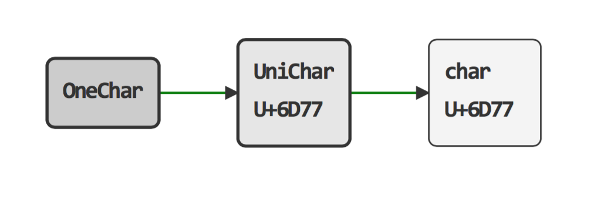
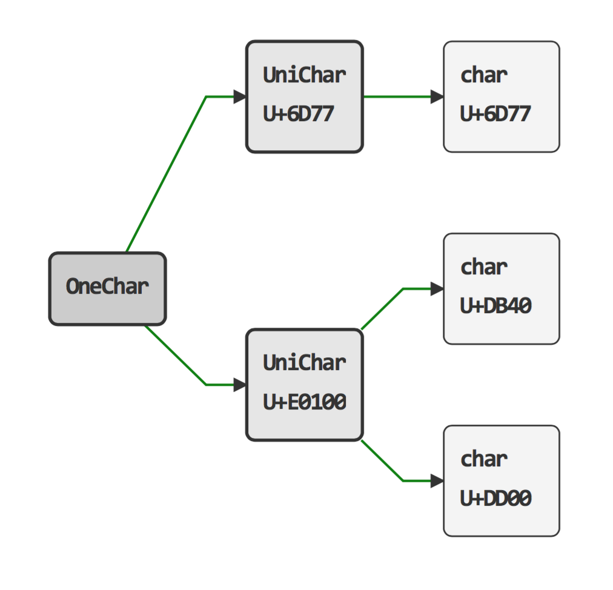

Tsumugi
=======

サロゲートの扱いを、少し簡単にします。

How to use
----------
### Source ###

    public class Sample {

        private static String SAMPLE_STRING = "芦田さんは芦\uDB40\uDD01屋のお嬢様だ";

        public static void main(String[] args) {

            // UniCharSequence Sample
            System.out.println(UniCharSequence.class.getSimpleName());
            final UniCharSequence uniCharSequence = new UniCharSequence(SAMPLE_STRING);
            System.out.println(uniCharSequence.length());// 13
            System.out.println(uniCharSequence.toCharList().stream().map(uniChar -> uniChar.toString()).collect(Collectors.joining(", ")));
            // 芦, 田, さ, ん, は, 芦, 󠄁, 屋, の, お, 嬢, 様, だ,

            // OneCharSequence Sample
            System.out.println(OneCharSequence.class.getSimpleName());
            final OneCharSequence oneCharSequence = new OneCharSequence(new UniCharSequence(SAMPLE_STRING));
            System.out.println(oneCharSequence.length());// 12
            System.out.println(oneCharSequence.toCharList().stream().map(oneChar -> oneChar.toString()).collect(Collectors.joining(", ")));
            // 芦, 田, さ, ん, は, 芦󠄁, 屋, の, お, 嬢, 様, だ,
        }
    }

Methods
-------

つJavadoc

Environment
-----------

	java version "1.8.0_51"

Build
-----

	mvn clean
    mvn site

Release History
---------------

+ **v0.1.0** - 2015-08-30
   + 最初のコミット

License
-------
Copyright &copy; 2015 [hiro20v](https://github.com/hiro20v)  
Distributed under the [MIT License][mit].  

[MIT]: http://opensource.org/licenses/MIT
