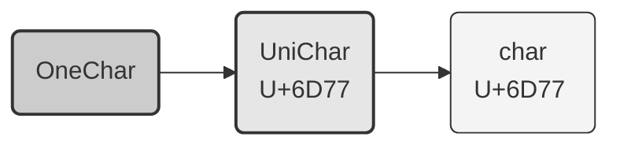
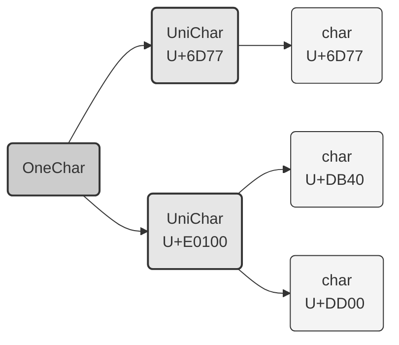

```mermaid
graph LR;
  OC0(OneChar)-->UC0;
  UC0(UniChar<br>U+6D77)-->C0(char<br>U+6D77&nbsp);
  style OC0 fill:#cccccc,stroke:#333,stroke-width:2px;
  style UC0 fill:#e6e6e6,stroke:#333,stroke-width:2px;
  style C0 fill:#f4f4f4,stroke:#333,stroke-width:1px;
```

```mermaid
graph LR;
  OC0-->UC0;
  OC0(OneChar)-->UC1(D);
  UC0(UniChar<br>U+6D77)-->C0(char<br>U+6D77&nbsp);
  UC1-->C1(char<br>U+DB40&nbsp);
  UC1(UniChar<br>U+E0100)-->C2(char<br>U+DD00&nbsp);
  style OC0 fill:#cccccc,stroke:#333,stroke-width:2px;
  style UC0 fill:#e6e6e6,stroke:#333,stroke-width:2px;
  style UC1 fill:#e6e6e6,stroke:#333,stroke-width:2px;
  style C0 fill:#f4f4f4,stroke:#333,stroke-width:1px;
  style C1 fill:#f4f4f4,stroke:#333,stroke-width:1px;
  style C2 fill:#f4f4f4,stroke:#333,stroke-width:1px;
```

